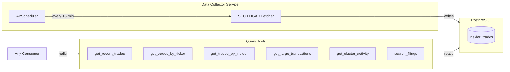

# SEC Insider Data Collector

## Scope

A simplified system with two components:
1. **Data Collector** — Fetches SEC Form 4 filings on a schedule, stores in PostgreSQL
2. **Query Tools** — Generic Python interface to query insider trading data

No signal engine — analysis is left to consumers (AI agents, scripts, etc.)

---

## Architecture



---

## What SEC Form 4 Contains

Form 4 is filed within 2 business days when insiders trade:

| Field | Example |
|-------|---------|
| Insider name | "Tim Cook" |
| Insider title | "Chief Executive Officer" |
| Company | "Apple Inc" (AAPL) |
| Transaction type | Purchase (P) or Sale (S) |
| Shares | 100,000 |
| Price | $182.50 |
| Transaction date | 2026-01-25 |
| Filing date | 2026-01-27 |

---

## Project Structure

```
insider_trading_tracker/
├── src/
│   ├── __init__.py
│   ├── config.py              # Environment settings
│   │
│   ├── collector/
│   │   ├── __init__.py
│   │   ├── sec_edgar.py       # SEC Form 4 fetcher + parser
│   │   └── scheduler.py       # APScheduler setup
│   │
│   ├── tools/
│   │   ├── __init__.py
│   │   └── queries.py         # Query functions for any consumer
│   │
│   └── db/
│       ├── __init__.py
│       ├── models.py          # SQLAlchemy models
│       └── connection.py      # DB connection
│
├── scripts/
│   └── run_collector.py       # Entry point for data service
│
├── docker-compose.yml
├── requirements.txt
└── README.md
```

---

## Database Schema

Single table for insider trades:

```sql
CREATE TABLE insider_trades (
    id SERIAL PRIMARY KEY,
    
    -- SEC identifiers
    accession_number VARCHAR(25) UNIQUE NOT NULL,
    
    -- Company
    ticker VARCHAR(10) NOT NULL,
    company_name VARCHAR(255),
    company_cik VARCHAR(10),
    
    -- Insider
    insider_name VARCHAR(255) NOT NULL,
    insider_title VARCHAR(100),
    insider_cik VARCHAR(10),
    is_director BOOLEAN,
    is_officer BOOLEAN,
    is_ten_percent_owner BOOLEAN,
    
    -- Transaction
    transaction_type VARCHAR(5) NOT NULL,
    transaction_date DATE NOT NULL,
    shares INTEGER,
    price_per_share DECIMAL(12, 4),
    total_value DECIMAL(15, 2),
    
    -- Holdings after transaction
    shares_owned_after BIGINT,
    
    -- Metadata
    filing_date DATE NOT NULL,
    filing_url TEXT,
    raw_data JSONB,
    created_at TIMESTAMP DEFAULT NOW()
);

CREATE INDEX idx_trades_ticker ON insider_trades(ticker);
CREATE INDEX idx_trades_filing_date ON insider_trades(filing_date DESC);
CREATE INDEX idx_trades_transaction_date ON insider_trades(transaction_date DESC);
CREATE INDEX idx_trades_insider ON insider_trades(insider_name);
CREATE INDEX idx_trades_type ON insider_trades(transaction_type);
```

---

## Query Tools

Generic Python functions any consumer can call:

| Function | Purpose |
|----------|---------|
| `get_recent_trades(days, type, min_value)` | Recent insider trades |
| `get_trades_by_ticker(ticker, days)` | All trades for a stock |
| `get_trades_by_insider(name, limit)` | Trading history for an insider |
| `get_large_transactions(min_value, days)` | Large trades above threshold |
| `get_cluster_activity(days, min_insiders)` | Multiple insiders trading same stock |
| `search_filings(query, limit)` | Search by name/ticker/company |

---

## Usage Example

```python
from src.tools.queries import InsiderTools

tools = InsiderTools(db_url="postgresql://...")

# Get recent purchases
recent_buys = await tools.get_recent_trades(days=7, transaction_type="P")

# Find large transactions
large_trades = await tools.get_large_transactions(min_value=500000)

# Detect cluster buying
clusters = await tools.get_cluster_activity(days=7, min_insiders=3)
```

---

## Implementation Todos

1. **Setup** — Project structure, config.py, requirements.txt, docker-compose.yml
2. **Database** — SQLAlchemy model for insider_trades, DB connection
3. **SEC Collector** — SEC EDGAR Form 4 fetcher with XML parsing
4. **Scheduler** — APScheduler to run collector every 15 minutes
5. **Query Tools** — Implement 6 query functions for consumers
